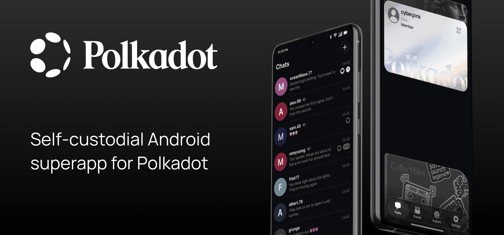

> [!WARNING]
> This is a prototype, reference implementation, and proof-of-concept. This open source code is provided for research, experimentation, and developer education only. It has not been audited, is actively experimental, and may contain bugs, vulnerabilities, or incomplete features. The app is a self-custodial wallet that can hold real assets — use at your own risk.

<div align="center">

# Polkadot Android

*Self-custodial Android superapp for Polkadot. Messaging, identity, payments, and built-in support for Polkadot applications — all-in-one, with you in full control of it.*

[](./LICENSE)
[](https://www.android.com)
[](https://kotlinlang.org)
[](https://polkadot.com)



</div>

## Features

- **Identity** — On-chain username with an allowance for free transactions, verified by Proof-of-Unique-Device.
- **Personhood** — Upgrade your username to a higher allowance via Proof-of-Personhood by playing the DIM2 videocall gesture game, and earn prizes and collectables.
- **Chat** — End-to-end p2p encrypted text messaging with media (images/video) and encrypted video/audio calls.
- **Payments** — Send and receive payments by username or QR code, and directly in chat.
- **Auto-conversion** — Top up your wallet and auto-convert it into the tokens you want.
- **Built-in dApp support & sandboxing** — Explore and use any dApp, and manage its sandbox permissions.
- **dApp modalities** — Supports SPA and Chat modalities for dApps.
- **Deeplinks** — Navigate the app and dApps through links and QR codes.
- **Remote signing** — Connect to Polkadot Desktop and Polkadot Web and use Mobile as a signer.
- **Multi-device sync** — Sync contacts and chats between Polkadot Mobile and Polkadot Desktop.
- **Cloud backups** — Back up your account using Google Drive.
- **Manual backups** — Keep your account stored only in the secure enclave storage locally.
- **Customization** — Fully customizable UI design system with 5 default themes.

## Getting started

<details>
<summary>Prerequisites</summary>

- **JDK 21** (Temurin) and **Android Studio**
- **Android SDK** (compileSdk 36) and **NDK r29**
- **Rust** (stable) with the Android targets and `cargo-ndk`:
  ```bash
  rustup target add aarch64-linux-android armv7-linux-androideabi x86_64-linux-android i686-linux-android
  cargo install cargo-ndk
  ```
- **Python 3** and **Node.js** for build helpers

Point Gradle at your SDK/NDK in `local.properties`:
```properties
sdk.dir=/path/to/android-sdk
ndk.dir=/path/to/android-ndk-r29
```

</details>

Clone the repo and open it in Android Studio:

```bash
git clone https://github.com/paritytech/polkadot-android-community.git
cd polkadot-android-community

# Optional: bootstrap native toolchain helpers
./developer-tools/setup.sh
```

Signing keys, `google-services.json`, and feature API keys are read from
`local.properties` or environment variables — see
[docs/DEPLOYMENT.md](./docs/DEPLOYMENT.md) for the full list of variables.

Select the **gp** flavor with a debug build type and an Android 10+ device or emulator, then build and run.

The app talks to Polkadot system chains (People Chain, Asset Hub, Bulletin Chain); the chain set is
delivered via remote config, and development and nightly builds are exercised against Polkadot's
[Paseo](https://github.com/paseo-network) testnet contour.

### Build and test from the command line

```bash
# Build a debug APK (lands in app/build/outputs/apk/gp/debug/)
./gradlew assembleGpDebug

# Run unit tests
./gradlew testGpDebugUnitTest
```

The project has two flavors (`gp` with Google services, `vanilla` without) and
`debug` / `nightly` / `release` build types — e.g. `./gradlew assembleGpRelease`
for a production build (requires the release keystore and secrets).

## How it works

Polkadot Android is a self-custodial superapp: your keys are created on your phone, stay on your phone, and everything else — identity, chat, payments, apps — is built on top of them using Polkadot's public chains instead of company servers.

### What it does

1. **Keeps your keys on your device.** Your account is generated locally and encrypted with Android's hardware-backed keystore. You choose how to back it up: an encrypted backup in your own Google Drive, or no backup at all — keys stored only on the device.
2. **Gives you an on-chain name.** You register a username on Polkadot's [People Chain](https://wiki.polkadot.com/learn/learn-system-chains/). Your phone proves it's a unique device, which earns you an allowance for free transactions — no tokens needed to start. Prove personhood by playing the DIM2 videocall gesture game to raise that allowance.
3. **Lets you chat without a messaging server.** Messages are end-to-end encrypted and delivered through the People Chain statement store, so there is no company inbox holding your conversations. Voice and video calls are encrypted and go directly peer-to-peer over WebRTC.
4. **Sends money to names, not addresses.** Pick a username (or scan a QR code, or pay right inside a chat) — the app resolves it to an account on-chain and sends the payment. Swaps and auto-conversion run on [Asset Hub](https://wiki.polkadot.com/learn/learn-assets/)'s liquidity pools.
5. **Runs Polkadot apps inside the app.** Type a `.dot` name and the app fetches the dApp's content (published on the Bulletin Chain and addressed via DotNS) and runs it in a sandbox. Each dApp gets its own permissions — network, camera, signing, storage — that you grant and revoke per app.
6. **Works as one account across devices.** Pair with Polkadot Desktop or Polkadot Web by scanning a QR code: your phone becomes the signer that approves their transactions, and contacts and chats sync between devices over the same encrypted channels.

### What it doesn't do

- It does **not** act as a custodian of your keys or your money — the keys are stored only on your device, and nobody (including the developers) can freeze, recover, or move your funds. If you lose your device and have no cloud/written backup, the associated accounts are gone.
- It does **not** route your chats and calls through company messaging servers — messages travel through the public chain, calls go peer-to-peer.
- It is **not** a production-hardened product — treat it as a reference implementation (see the warning at the top).

### Under the hood

A modular **Kotlin** / **Jetpack Compose** codebase: features are split into `api` and `impl` modules wired with Hilt, performance-critical crypto is compiled from **Rust** via the NDK ([`bindings/`](./bindings)), and chain access goes through [substrate-sdk-android](https://github.com/novasamatech/substrate-sdk-android) (JSON-RPC, storage subscriptions, extrinsics).

This repository does not ship a hosted CI/CD pipeline. Build-time configuration
and the steps to sign and publish the app to Google Play, Firebase App
Distribution, or GitHub Releases are documented in [docs/DEPLOYMENT.md](./docs/DEPLOYMENT.md).

Architecture conventions, module layout, and coding standards are documented in [CLAUDE.md](./CLAUDE.md).

## Contributing

Issues and pull requests are welcome. Read [CONTRIBUTING.md](./CONTRIBUTING.md) before you start.

## Security

Before deploying this for real use cases, you are responsible for:

- Reviewing the code yourself — we publish a reference, not a hardened production build.
- Checking that the dependencies are up to date and free of known vulnerabilities.
- Securing your own fork or deployment environment (keys, secrets, network configuration).
- Tracking the latest commits for security fixes; older revisions are not backported.

Report vulnerabilities responsibly following [Parity's security policy](https://github.com/paritytech/.github/blob/main/SECURITY.md) — do not open public issues for security reports. For Parity's disclosure process and Bug Bounty programme, see [parity.io/bug-bounty](https://parity.io/bug-bounty).

## License

Licensed under the **GNU General Public License v3.0** — see [LICENSE](./LICENSE).
